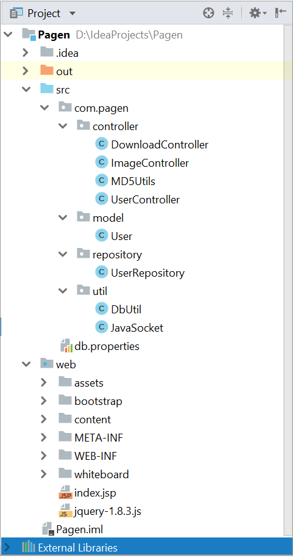

# PAGEN
### Overview
------------------
Pagen is a handy, lightweight, fast picture/HTML conversion tool, aiming to make writing HTML code easier. Pagen offers user two choices: directly upload picture or create a picture by themselves.

### Overall structure
-------------------

#### Java Backend Structure

##### Controller:

Controller package provides the main services and manages the major functionalities in the backend.

DownloadController is used for the users to download the generated html file. After the image has been converted into html code and stored in the backend server, the controller will create an output stream to write the html file to the client browsers.

ImageController is used to save the images uploaded by users in server and build connection with the Python backend using socket. Send image path after the connection established.

UserController is used to manage the user registration and login event. Interaction with the MySQL database is also included in this controller. It will reject the signup request if the user name user entered is already in use.

##### Model:

The package contains JavaBean files, which contains the various properties and the corresponding getter and setter methods to provide convenient access to the fields.

The User java file contains three fields representing user info stored in database, which are “username”, “password” and “emailaddress”.

Repository:

Used to interact with the pagen_user database table.

##### Util:

1. DbUtil class is used to get connection with the MySQL database.

2. JavaSocket class is used to connect to Python backend and get html file path from it through socket.
#### Algorithm 

This markdown file illustrate basic installation requirement and detail structure of algorithm that Generating HTML Code from a hand-drawn wireframe.

### Support manual
-------------------
#### Login
User can login and log out and their password will be protected by using md5
#### Upload
User can upload saved picture by clicking the __submit__ button and there will be a pop window to let you save HTML file when conversion is done.
#### Whiteboard 
##### Tool Button
- Click Pencil button then your mouse will become a pencil then you can draw contour of your website with it.
- Click Eraser button then your mouse will become a rubber then you can eraser the part you want to eraser.
- Click Empty button then you can clean up the whiteboard content you have already draw.
- Click Undo button then you can cancel the previous action you did.
- Click Redo button then you can recover the action you canceled before.

##### Shape Button

- Click Line button then you can draw a line.
- Click Rectangle button then you can draw a rectangle.
- Click Font button then you can add text box.

##### Line Setting Button

- Click Width then you can change the thickness of the your line.
- Click Boarder Color button you can change the color of your contour.
- Click Filling Color button you can change the filling color of your pattern.

##### Font Setting Button

- Click Font button you can change the font of the text you write.
- Click Font Style button you can change the font style of the text you write.
- Click B button you can bold front.
- Click / button you can make the text italic.

### Installation and configuration
-------------------
- Intellij IDEA is used to develop the project
- MySQL database is used to store the user information (username, password, email address)
- Tomcat is used as the open source server engine

#### perquisites
 - Java
 - MySQL
 - Tomcat
 - Python3
 - Pip3

#### support tool
 - Navicat
 - Idea
 - PyCharm

#### Required Packages

 - Keras
 - tensorflow
 - nltk
 - opencv-python
 - numpy
 - h5py
 - matplotlib
 - Pillow
 - tqdm
 - scipy
 
 using follow command in shell to install required packages.
```
pip3 install XXX(package name)
```
### Additional Files
- [user story](./User Story.pdf)
- [architecture](./architecture.pdf)
- [project plan](./SC_Project_Plan.pdf)
- [test plan](./testing plan.pdf)

